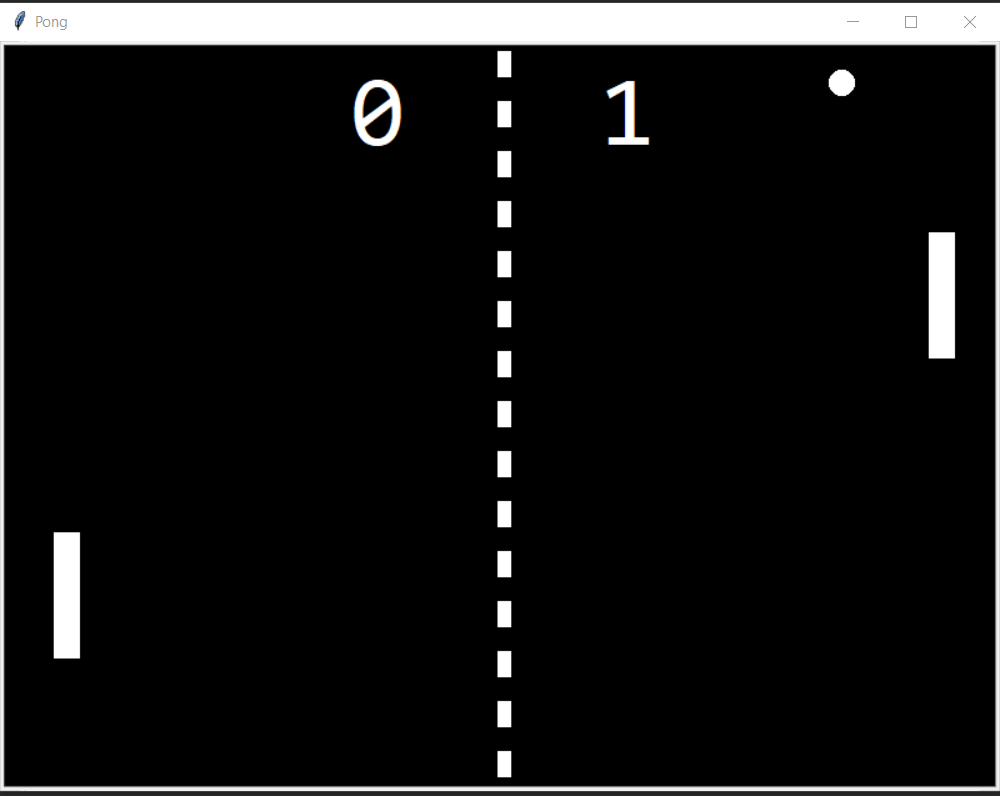

     ______   _____  ______   ______ 
    (_____ \ / ___ \|  ___ \ / _____)
     _____) ) |   | | |   | | /  ___ 
    |  ____/| |   | | |   | | | (___)
    | |     | |___| | |   | | \____/|
    |_|      \_____/|_|   |_|\_____/ 

Object-oriented programming to recreate the classic game of Pong using Python

  

                                 
